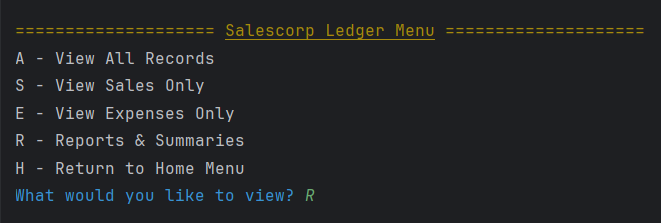
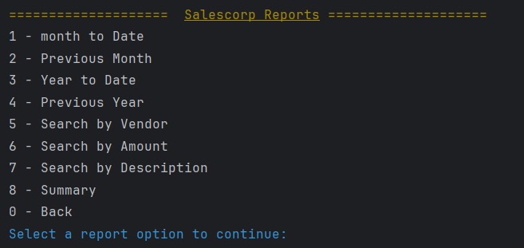
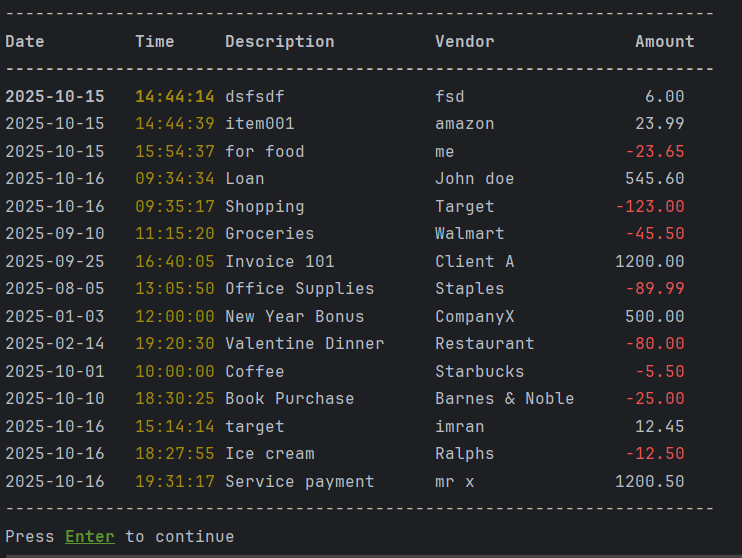

# 🧾 Accounting Ledger App

A **Java console application** that helps users record deposits, payments, and view their transaction history (ledger) and provide reports.
This project was built as a beginner-friendly exercise to practice **object-oriented programming**, **file handling**, and **exception management** in Java.

---

## 🚀 Features

* Add deposits (income)
* Make payments (expenses)
* View full ledger
* Filter transactions (e.g., deposits only, payments only)
* Custom Searching
  * By vendor name
  * By description
  * By amount
* Transaction month and year based reporting functionality
  * Month to Date
  * Previous Month
  * Year to Date
  * Previous Year
* Save and load data from a csv file
* Simple text-based menu system
* User input error handling
* Clean and formatted user friendly outputs

---

## 🧠 Concepts Used

This project demonstrates several **core Java concepts**:

* Classes and Objects
* Constructors, Getters & Setters
* Arrays / ArrayLists
* Loops and Conditionals
* Exception Handling (`try`, `catch`, `throws`)
* File I/O (reading & writing transactions to a file)
* Scanner input for user interaction

---
## 🖥️ Screenshots

<p align="center">
  
</p>
<p align="center">
  
</p>
<p align="center">
  
</p>
<p align="center">
  
</p>
<p align="center">
  
</p>


## 🧩 Code Snippets

### 👇 A robust customSearching method that uses selected filter and user input to desplay output.
```java public static void customSearch(String searchBy, String input){
        File ledger = new File("transactions.csv");

        try(BufferedReader reader = new BufferedReader(new FileReader(ledger))){
            String line;
            while((line = reader.readLine()) != null){
                String[] sections = Tools.transactionSplitter(line);

                if(sections[4].equalsIgnoreCase("amount")){
                    Tools.headerFormatter();
                    continue;
                }

                Transaction t = createTransactionObject(line);

                switch (searchBy){
                    case "vendor":{
                        if(sections[3].toLowerCase().contains(input.toLowerCase())){
                            t.printFormatter();
                        }
                        break;
                    }
                    case "description":{
                        if(sections[2].toLowerCase().contains(input.toLowerCase())){
                            t.printFormatter();
                        }
                        break;
                    }
                    case "amount":{
                        double amount = Double.parseDouble(sections[4]);
                        if(Math.abs(amount) == Math.abs(Double.parseDouble(input))){
                            t.printFormatter();
                        }
                        break;
                    }
                    default:
                        System.out.println("No matching record found.");
                        break;
                }
            }
            System.out.println("-----------------------------------------------------------------------");

            Tools.enterToContinue();
            Menu.reportsMenu();
        }catch (IOException e){
            System.out.println("Error reading file." + e.getMessage());
        }
    }

## 🛠️ How to Run

### 1. Clone the repository

```bash
git clone https://github.com/iBel251/Accounting-Ledger-App.git
```

### 2. Open in your IDE

Open the folder in **IntelliJ IDEA**, **VS Code**, or any Java IDE.

### 3. Compile and run
Navigate to Main.java in src/main/java/com.capstone directory and run the program

---

## 💾 File Handling

All transactions are saved to a local text file (e.g., `transactions.txt`) so that data is **retained between sessions**.

---

## 📂 Project Structure

```
Accounting-Ledger-App/
│
├── src/
│   └── main/java/capstone/
│       ├── Main.java
│       ├── Menu.java
│       ├── Services.java
│       ├── Transaction.java
│       ├── StringFormatter.java
│       ├── Tools.java
│       └── Validators.java
│
└── transactions.txt
```

---

## 🎯 Future Improvements

* Implement sorting and filtering by date
* Include balance summaries
* Build a GUI
* Improve file structure or switch to JSON storage
* Export filtered list into CSV and Excel files

---

## 👨‍💻 Author

**Imran Ahmed**
Java Developer | Passionate about learning clean and structured coding.

---
